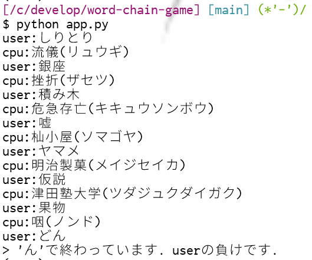

# しりとり

 

## Quick Start
レポジトリをcloneして，`app.ipynb`ファイルをGoogle Colabで動かすのが一番簡単．

ローカルで動かすなら，MeCabのインストールをして(結構めんどい)，`app.py`を実行する．

### Screenshot

 

## Feature
- 文字列の比較ではなく，形態素解析器(mecab)を用いて"読み"の比較を行うことで，ひらがな，カタカナ，漢字の表記揺れを吸収した
- 促音 拗音にも対応している
- cpuの返す単語は，<https://taku910.github.io/mecab/#download>のIPA辞書(ipadic)から名詞系のものを選択，単語と読みだけの独自辞書(`vocabulary.pickle`)を作成し，それを読み込んで(`_dict`)使用している 
  →今回は`Noun.csv`,`Noun.org.csv`,`Noun.verbal.csv`の三種類を使用したが，他のやつを使いたければ`/data/`ディレクトリに使いたい`*.csv`ファイルを置いた後，`make_dict.py`を実行すればよい．
- ユニットテストもちゃんと書いた．`pytest -v`で実行できる．

 

## References
- <https://taku910.github.io/mecab/>
